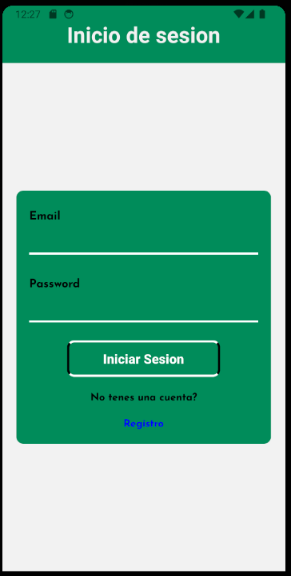
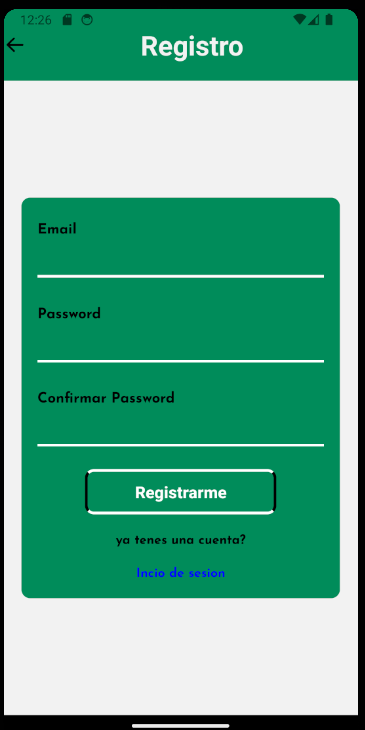
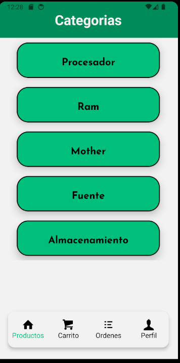
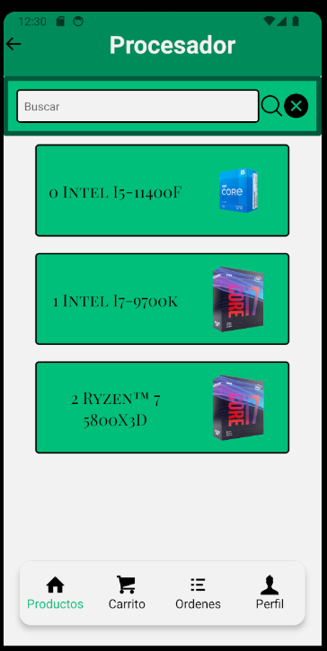
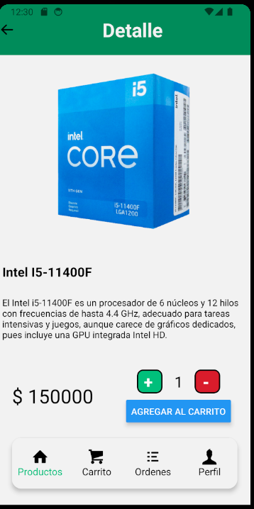
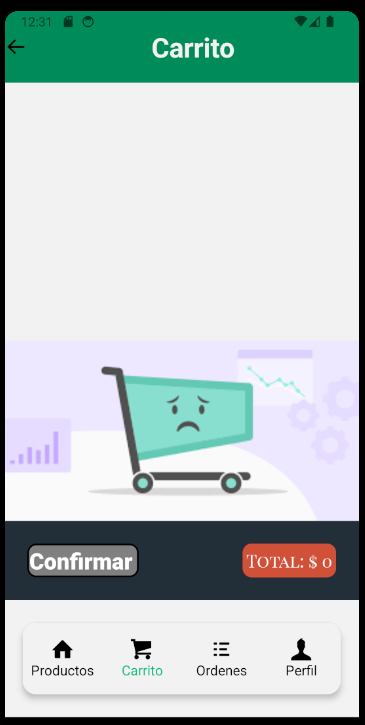
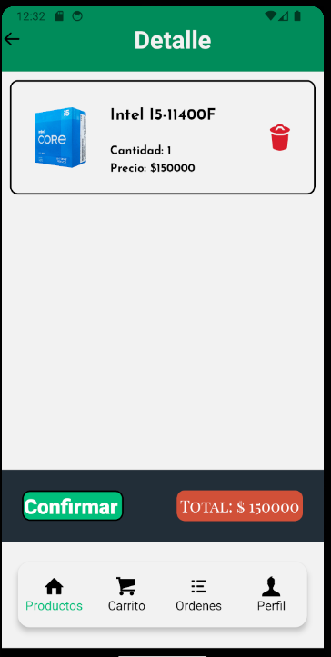
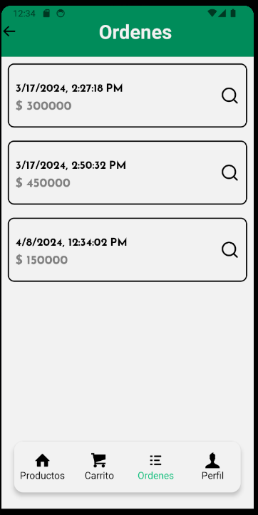
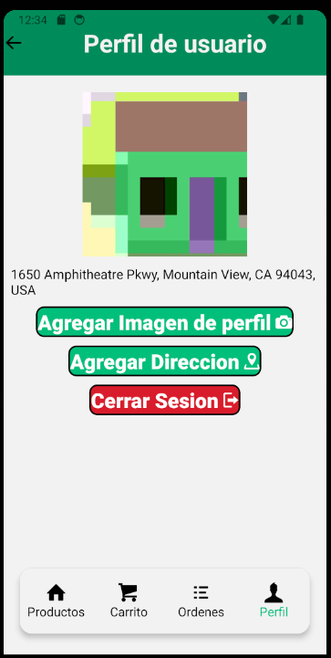

# Aplicación de Comercio Electrónico - React Native

Esta aplicación ofrece una experiencia de compra en línea completa y accesible, desarrollada con React Native.

## Características Principales

### Pantalla de Usuario

- **Seguridad:** Solo usuarios autenticados pueden acceder a su perfil y realizar transacciones.
- **Perfil:** Muestra detalles del usuario, incluyendo nombre y dirección.




### Autenticación con Firebase

- Implementa el sistema de autenticación de Firebase para asegurar el acceso de usuarios.
- Permite el inicio de sesión y registro seguro.

### Pantalla de Categorías

- Presenta una selección de categorías en formato de tarjetas.
- Al seleccionar una categoría, se accede a la pantalla de productos asociados.

### Pantalla de Productos

- Lista todos los productos en tarjetas con nombre e imagen.
- Incluye un buscador para filtrar productos por nombre.
- Al seleccionar un producto, se accede a su pantalla de detalles.

### Pantalla de Detalles del Producto

- Ofrece una descripción detallada del producto.
- Muestra el precio y la disponibilidad en stock.
- Permite añadir el producto al carrito de compras.





### Navegación Inferior

```javascript
        const TabNavigator = () => {
  return (
        <Tab.Navigator
          screenOptions={{
            headerShown:false,
            tabBarShowLabel:false,
            tabBarStyle: styles.tabBar

          }}
        >
          <Tab.Screen
             name="ShopStack"
             component={ShopStack}
             options={{
              tabBarIcon:({focused}) => <TabIcon icon="shop" label="Productos" focused={focused}/>
             }}
          />
          <Tab.Screen 
              name="CartStack" 
              component={CartStack}
              options={{
                tabBarIcon:({focused}) =>  <TabIcon icon="shopping-cart" label="Carrito" focused={focused}/> 
              }}
             />
             <Tab.Screen 
              name="OrdersStack" 
              component={OrdersStack}
              options={{
                tabBarIcon:({focused}) => <TabIcon icon="list" label="Ordenes" focused={focused}/> 
              }}
             />
            <Tab.Screen 
              name="ProfileStack" 
              component={ProfileStack}
              options={{
                tabBarIcon:({focused}) => <TabIcon icon="user" label="Perfil" focused={focused}/> 
              }}
             />
      </Tab.Navigator>
  )
}

```

- **Pestaña 1 - Productos:** Categorías y productos (stack principal).
- **Pestaña 2 - Carrito:** Detalles del carrito de compras con resumen y botón para finalizar la orden.
- **Pestaña 3 - Órdenes:** Historial de órdenes realizadas.
- **Pestaña 4 - Perfil:** Información del usuario, ubicación y carga de imagen de perfil.







## Tecnologías Utilizadas

- **Firebase Authentication:** Implementa el sistema de autenticación de Firebase para gestionar la seguridad de la aplicación.
- **React Native Navigation Stack:** Gestiona la navegación entre pantallas.
- **React Native Navigation Buttom tap:** Gestiona la navegación entre pestañas.
- **Expo-Location:** Permite acceder y gestionar la ubicación del usuario.
- **Expo-Picker-Image:** Facilita la carga de imágenes de perfil.
- **Redux:** Centraliza y gestiona el estado de la aplicación.
- **RTK Query y Firebase:** Realiza operaciones de lectura/escritura en la base de datos.

## Instalación

1. Clona el repositorio: `git clone https://github.com/NicoTecno/ecommerceReactNative.git`
2. Instala las dependencias: `npm install`
3. Configura las claves de API para servicios externos (Expo-Location, Firebase, etc.).
4. Configura las credenciales de Firebase en tu proyecto.
5. Ejecuta la aplicación: `npm start`